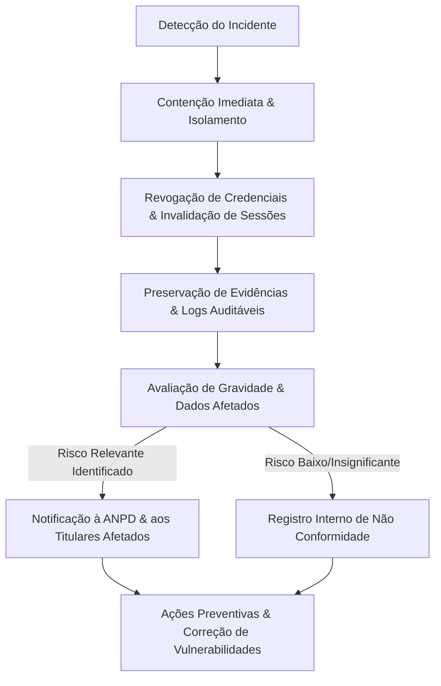

# PROGRAMA DE GOVERNANÇA E PRIVACIDADE DE DADOS (LGPD)
**Plataforma:** Rumo ao CFO CBMERJ  
**Marco Regulatório:** Lei Geral de Proteção de Dados Pessoais (Lei nº 13.709/2018 - LGPD)  
**Versão do Documento:** 1.0  
**Data da Implementação Técnica:** Setembro de 2026  
**Status:** Implementação Técnica Concluída | Pendente de Revisão Jurídica Formal  

---

## 1. VISÃO GERAL E ARQUITETURA DE PRIVACIDADE

O projeto **Rumo ao CFO CBMERJ** é uma plataforma educacional web voltada para a preparação de candidatos ao Curso de Formação de Oficiais do Corpo de Bombeiros Militar do Estado do Rio de Janeiro.

Este documento consolida a arquitetura de privacidade por concepção e por padrão (*Privacy by Design and by Default* - Art. 46, §2º da LGPD) implementada na plataforma, integrando medidas técnicas, administrativas e de segurança da informação.

### 1.1 Papéis e Agentes de Tratamento (Art. 5º da LGPD)
* **Controlador:** Rumo ao CFO (Entidade mantenedora da plataforma educacional).
* **Operadores:** Subprocessadores essenciais de infraestrutura tecnológica (banco de dados, envio de e-mails, CDN e proteção perimetral).
* **Encarregado de Proteção de Dados (DPO):** Indicado via variável de ambiente `PRIVACY_DPO_NAME`, com canal de comunicação oficial configurado em `PRIVACY_CONTACT_EMAIL` (padrão: `privacidade@rumoaocfo.com.br`).
* **Titulares:** Candidatos cadastrados (cadetes), administradores, equipe de suporte e visitantes do portal.

---

## 2. INVENTÁRIO E MAPEAMENTO DE DADOS PESSOAIS (ROPA)

Em conformidade com o Art. 37 da LGPD, a tabela a seguir apresenta o registro das operações de tratamento de dados pessoais realizadas pela aplicação:

| Categoria de Dados | Dados Coletados | Origem | Finalidade / Justificativa | Base Legal (Art. 7º LGPD) | Local de Armazenamento | Retenção / Descarte | Compartilhamento / Subprocessador |
| :--- | :--- | :--- | :--- | :--- | :--- | :--- | :--- |
| **Identificação Cadastral** | Nome completo, e-mail, nome de usuário, telefone (opcional), foto de perfil (opcional) | Formulário de Cadastro / Perfil preenchido pelo Titular | Autenticação, identificação na plataforma, comunicação educacional | Art. 7º, V (Execução de Contrato) | Tabela `users` e `user_profiles` (PostgreSQL / SQLite) | Enquanto a conta permanecer ativa + 5 anos após término (prescrição cível/tributária) ou até anonimização requerida | Provedor de E-mail Transacional (Resend) |
| **Credenciais de Segurança** | Hash de senha (bcrypt com fator de custo 12), segredos TOTP/2FA criptografados, recovery codes | Gerado na criação/redefinição de conta | Controle de acesso estrito e prevenção de invasão de conta | Art. 7º, II (Cumprimento de Obrigação Legal) e Art. 7º, IX (Legítimo Interesse) | Tabela `users` e `admin_two_factor_auth` (colunas restritas) | Vitalício enquanto conta existir; expira imediatamente em caso de redefinição/exclusão | Não compartilhado com terceiros |
| **Sessões e Auditoria** | Tokens de sessão opacos (HMAC-SHA256), IP anonimizado/mascarado, User-Agent, data/hora | Cabeçalhos HTTP da requisição durante login | Garantia da segurança da informação, prevenção a ataques de força bruta, controle de dispositivo único | Art. 7º, IX (Legítimo Interesse) e Marco Civil da Internet (Lei 12.965/14, Art. 15) | Tabelas `sessions`, `security_events` e `audit_logs` | Sessões: 7 dias de inatividade. Logs de auditoria: 6 meses (Art. 15 Marco Civil) | Não compartilhado |
| **Progresso Educacional** | Horas estudadas, cronograma de matérias, questões respondidas, desempenho simulado, anotações | Interação do aluno com a plataforma | Fornecimento do serviço educacional, geração de estatísticas e gráficos de evolução | Art. 7º, V (Execução de Contrato) | Tabelas `study_sessions`, `user_state`, `cadet_study_logs` | Duração do contrato ou até exercício de direito de eliminação | Não compartilhado |
| **Consentimento e Políticas** | Categoria de consentimento, versão do documento aceito, data/hora, hash do IP do aceite, status | Formulário de aceite no cadastro e banner de cookies | Comprovação regulatória de conformidade e gestão de preferências do titular | Art. 7º, I (Consentimento) e Art. 7º, II (Obrigação Legal) | Tabela `consent_records` | 5 anos após revogação (para fins probatórios perante ANPD/Procon) | Não compartilhado |
| **Solicitações de Privacidade** | Protocolo (`LGPD-REQ-XXXXXX`), tipo de direito pleiteado, e-mail do titular, status, parecer | Formulário da Central de Privacidade (`/api/privacy/requests`) | Cumprimento tempestivo dos direitos dos titulares (Art. 18 LGPD) | Art. 7º, II (Cumprimento de Obrigação Legal) | Tabela `privacy_requests` | 5 anos para comprovação perante a ANPD | Não compartilhado |
| **Registros Financeiros** | ID da transação, status do pagamento, valor, método (PIX/Cartão), ID do cliente no gateway | Gateway de Pagamento | Faturamento, entrega do serviço contratado, prevenção à fraude fiscal | Art. 7º, II (Obrigação Legal/Fiscal) e V (Contrato) | Tabelas `orders`, `refund_requests` | Mínimo de 5 anos (Código Tributário Nacional e Código de Defesa do Consumidor) | Gateway de Pagamento parceiro |

### 2.1 Princípio da Minimização de Dados (Art. 6º, III)
* **Dados de Pagamento:** A aplicação **NÃO** coleta, processa nem armazena números de cartão de crédito, código de segurança (CVV) ou datas de validade. Toda a coleta de dados de cartão ocorre diretamente no ambiente seguro do gateway parceiro.
* **Inteligência Artificial Educacional:** Nas análises de desempenho via IA (`/api/ai/study-analysis`), os prompts utilizam exclusivamente métricas agregadas (ex.: "Direito Constitucional: 120 minutos, 85% de acertos"). Nomes, e-mails, senhas, IPs e dados cadastrais são estritamente filtrados antes de qualquer envio ao modelo.
* **Dados Sensíveis:** A plataforma não coleta nem processa dados de origem racial/étnica, convicção religiosa, opinião política, filiação a sindicato, dados genéticos ou biométricos (Art. 5º, II da LGPD).

---

## 3. DIREITOS DO TITULAR E FLUXOS OPERACIONAIS (ART. 18)

A plataforma implementa canais nativos e automatizados para viabilizar o exercício dos direitos previstos no Art. 18 da LGPD:

### 3.1 Portabilidade e Acesso aos Dados (Art. 18, II e V)
* **Endpoint Seguro:** `GET /api/privacy/export`
* **Mecanismo:** O usuário autenticado pode baixar um arquivo estruturado em formato JSON contendo seu perfil completo, sessões registradas, estatísticas de estudo, metas e histórico de consentimentos.
* **Salvaguarda de Segurança:** O DTO de exportação é submetido a uma sanitização estrita: campos como hashes de senha, segredos 2FA, tokens de redefinição e chaves internas de sistema são completamente omitidos.

### 3.2 Correção de Dados Incompletos ou Inexatos (Art. 18, III)
* Disponível tanto pelo próprio perfil do usuário (`/api/profile`) quanto pela abertura de protocolo formal de retificação na Central de Privacidade.

### 3.3 Anonimização e Eliminação Segura (Art. 18, IV e VI)
* **Problema Arquitetural Resolvido:** A exclusão física descontrolada (*hard delete*) de registros quebra chaves estrangeiras e a integridade de transações financeiras e questões resolvidas.
* **Solução Técnica Implementada (`anonymizeUser`):**
  1. O e-mail do usuário é substituído por um identificador irreversível: `deleted-<uuid>@anonymized.cfo`.
  2. O nome e apelido são sobrescritos para `"Usuário Anonimizado"`.
  3. A senha é substituída por um marcador de hash bcrypt não autenticável (`$2b$12$ACCOUNT_ANONYMIZED_LGPD_...`).
  4. São permanentemente expurgados: telefones, fotos de perfil, biografias, sessões ativas (`sessions`), bloqueios de segurança (`account_locks`), tokens de redefinição e preferências personalizadas (`user_state`).
  5. Mantém-se o histórico contábil e de pedidos anonimizado para cumprimento do Art. 16, I da LGPD (cumprimento de obrigação legal ou regulatória pelo controlador).

### 3.4 Gestão de Consentimento e Revogação (Art. 18, IX)
* Histórico com controle de versão registrado na tabela `consent_records`.
* Revogação imediata de categorias opcionais por meio de `POST /api/privacy/consent`.

---

## 4. POLÍTICA E GESTÃO DE COOKIES

A plataforma classifica suas tecnologias de armazenamento no navegador em quatro categorias:

1. **Necessários (Essenciais):**
   * Finalidade: Autenticação de sessão (`cfo_session`), tokens CSRF/HMAC e prevenção anti-bot.
   * Base Legal: Art. 7º, V (Execução de Contrato) e Art. 7º, IX (Legítimo Interesse em Segurança).
   * Status: Não passíveis de recusa (a desativação inviabiliza o funcionamento da conta).
   * Configuração de Segurança: Flag `HttpOnly`, `Secure` em produção, `SameSite=Lax`.

2. **Preferências:**
   * Finalidade: Tema visual (claro/escuro) e colapso de painéis educacionais.
   * Armazenamento: `localStorage` local.

3. **Analíticos (Opcionais):**
   * Finalidade: Métricas de navegação e diagnóstico de usabilidade.
   * Bloqueio: Bloqueados por padrão até manifestação voluntária do usuário.

4. **Marketing (Opcionais):**
   * Finalidade: Mensuração de campanhas de captação para o concurso.
   * Bloqueio: Bloqueados por padrão.

---

## 5. SUBPROCESSADORES E TRANSFERÊNCIA INTERNACIONAL DE DADOS

| Fornecedor | Serviço Prestado | Dados Trafegados | Localização dos Servidores | Salvaguarda LGPD |
| :--- | :--- | :--- | :--- | :--- |
| **Resend Inc.** | E-mails transacionais (boas-vindas, redefinição de senha) | E-mail e primeiro nome | Estados Unidos (EUA) | Cláusulas Padrão Contratuais (SCC) e Art. 33, II da LGPD |
| **Cloudflare Inc.** | CDN, mitigação DDoS e Turnstile anti-bot | Endereço IP (criptografado/efêmero), User-Agent | Rede Global Anycast | Tratamento estritamente necessário para segurança de redes (Art. 7º, IX) |
| **PostgreSQL / Neon / Render** | Hospedagem de banco de dados e aplicação | Banco de dados relacional criptografado em repouso | Estados Unidos / Europa | Conexões protegidas por TLS 1.3 obrigatório; encriptação AES-256 |
| **Google Cloud (Gemini API)** | Análise pedagógica de horas de estudo (opcional) | Métricas pedagógicas anonimizadas (sem dados cadastrais) | Estados Unidos | Minimização de dados; cláusulas contratuais de proteção |

---

## 6. PLANO DE RESPOSTA A INCIDENTES DE SEGURANÇA (ART. 46 E 48)

Em cumprimento ao Art. 48 da LGPD, a plataforma estabelece o seguinte procedimento em caso de incidente de segurança que possa acarretar risco ou dano relevante aos titulares:

### 6.1 Prazos e Responsabilidades
* **Prazo de Avaliação Preliminar:** Até 24 horas após o alerta.
* **Comunicação à ANPD e aos Titulares:** Realizada pelo Encarregado de Dados em prazo razoável (conforme regulamentação da ANPD), contendo:
  1. A natureza dos dados pessoais afetados.
  2. As informações sobre os titulares envolvidos.
  3. As medidas técnicas e de segurança utilizadas para proteção dos dados.
  4. Os riscos relacionados ao incidente.
  5. Os motivos de eventual demora na comunicação.
  6. As medidas que foram ou que serão adotadas para reverter ou mitigar os prejuízos.

---

## 7. MATRIZ DE REVISÃO E AÇÕES PENDENTES

| Área | Item | Responsável | Status |
| :--- | :--- | :--- | :--- |
| **Técnica** | Migração do esquema para `consent_records` e `privacy_requests` | Engenharia de Software | Concluído (Migration 027) |
| **Técnica** | Endpoint de anonimização e exportação de dados com DTO seguro | Engenharia de Software | Concluído |
| **Técnica** | Painel administrativo com controle Step-Up 2FA para LGPD | Engenharia de Software | Concluído |
| **Técnica** | Modais de Termos de Uso, Política de Privacidade e Cookies | Engenharia de Software | Concluído |
| **Jurídica** | Revisão textual final da Política de Privacidade e Termos de Uso | Assessoria Jurídica / DPO | Pendente de Validação Jurídica |
| **Governança**| Nomeação formal do Encarregado de Dados (DPO) e registro perante a ANPD | Diretoria Executiva | Pendente de Ação Administrativa |
| **Operacional**| Treinamento da equipe de suporte no atendimento a chamados LGPD | Operações / Suporte | Pendente de Agendamento |
